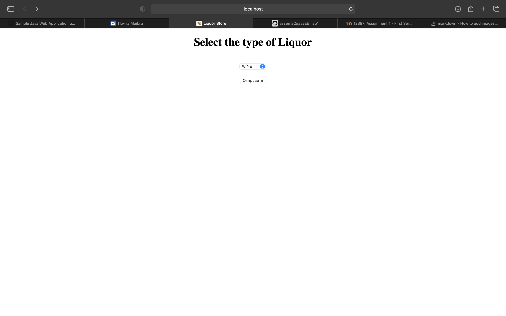

# javaEE_lab1
Lab 1
I configured and ran your first Servlet Application

1. Created a Java EE Web Application Project using IDE
2. I installed and configured the web server to run my App
3. Created a sample application

